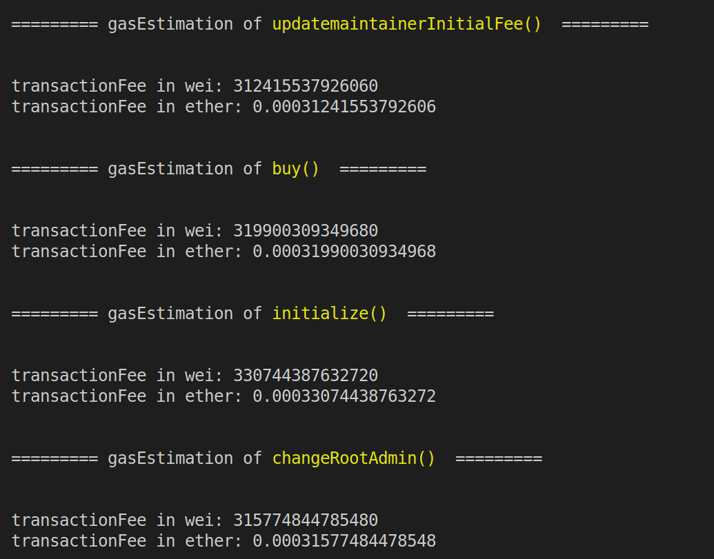

# GasCostEstimation
- Using this code we can calculate gascost of all functions in a contract.
##  Install: -- needed packages 


 ```
cd src
```

```
npm install
```
 ```
cd src/contracts
```
```
npm install
```
### Compiling the Contracts 🛠️

 Run: -- To Compile contracts to create artifacts of contracts

```
npx hardhat compile
```
### To Start

```
npx ts-node src/main.ts
```
### Example output




